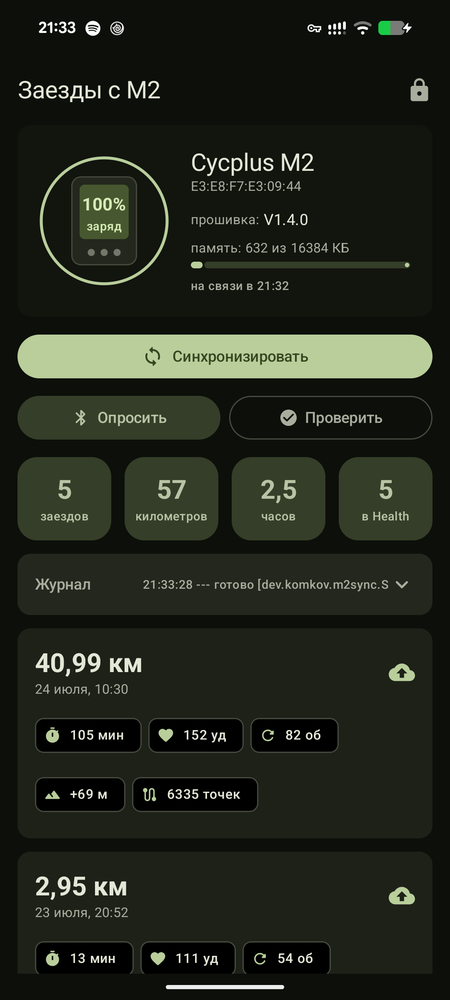
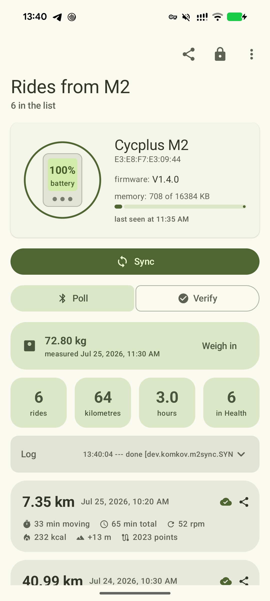

# M2 Sync — Cycplus M2 / XOSS bike computer → Health Connect

[](https://github.com/andrewkomkov/cycplus-m2-sync/actions/workflows/build.yml)
[](https://github.com/andrewkomkov/cycplus-m2-sync/releases)
[](LICENSE)

Download rides from a **Cycplus M2** (and other XOSS-family) GPS bike computer straight to your
Android phone over Bluetooth LE, write them into **Health Connect**, and export the raw `.fit`
files anywhere you like — **without the vendor cloud, without an account, without the XOSS app**.

[Читать по-русски](README.ru.md)

| Light on data, honest about it | Same app, English locale |
| --- | --- |
|  |  |

## Why this exists

The stock workflow sends every ride through the vendor's cloud, and the Google side of it is
disappearing too: the **Google Fit APIs are shut down at the end of 2026** and the Fit app is being
replaced by Google Health, with **Health Connect** as the on-device store everything now talks to.
This app writes directly into Health Connect, so your rides land where Google Health, Strava,
Garmin Connect and the rest can read them — and the `.fit` files stay yours.

## Features

- **Bluetooth LE sync** — finds the bike computer, downloads only new rides (228 KB in ~13 s)
- **Health Connect import** — cycling session with GPS route, heart rate, cadence, speed,
  distance, elevation gain; pauses are written as segments so *moving time* stays correct
- **No duplicates** — de-duplicated by `clientRecordId`, re-running a sync is safe
- **Raw `.fit` export** — share one ride or many at once, with readable file names like
  `2026-07-24_10-30_40.99km_cycplus-m2.fit`
- **Sync on launch** — opening the app finds the bike computer and pulls new rides in ~3 s
- **Update check** — asks GitHub Releases for a newer version; both toggles live in the ⋮ menu
- **Fully scriptable over ADB** — every action runs headless, no tapping required
- **Material 3 UI** with dynamic colour, English and Russian localisation
- **Device card** — model, firmware, battery, free memory read straight off the device

## Install

Grab the APK from [Releases](https://github.com/andrewkomkov/cycplus-m2-sync/releases) and
install it, or build from source:

```bash
git clone https://github.com/andrewkomkov/cycplus-m2-sync.git
cd cycplus-m2-sync/android
./gradlew :app:assembleDebug
adb install -r app/build/outputs/apk/debug/app-debug.apk
```

Requirements: Android 13 or newer with Health Connect (built into Android 14+).

Permissions can be granted from the app (lock icon), or entirely from a terminal:

```bash
for p in BLUETOOTH_SCAN BLUETOOTH_CONNECT POST_NOTIFICATIONS; do
  adb shell pm grant dev.komkov.m2sync android.permission.$p
done
for p in WRITE_EXERCISE WRITE_EXERCISE_ROUTE WRITE_HEART_RATE WRITE_DISTANCE \
         WRITE_SPEED WRITE_ELEVATION_GAINED READ_EXERCISE READ_HEART_RATE READ_DISTANCE; do
  adb shell pm grant dev.komkov.m2sync android.permission.health.$p
done
```

## Usage from the terminal

```bash
S="adb shell am start-foreground-service -n dev.komkov.m2sync/.SyncService -a dev.komkov.m2sync"

$S.SCAN                    # look for the bike computer
$S.SYNC                    # download new rides and import them
$S.SYNC -e name M2_XXXX    # target a specific device
$S.INFO                    # firmware, battery, free memory
$S.IMPORT                  # import already downloaded files only
$S.IMPORT -e force 1       # re-import everything (after changing import logic)
$S.STATUS                  # what is stored locally
$S.VERIFY                  # read back from Health Connect and compare
$S.PERMS                   # permission strings Health Connect expects

adb logcat -s M2SYNC       # follow the work
```

Downloaded files live in `/storage/emulated/0/Android/data/dev.komkov.m2sync/files/fit`:

```bash
adb pull /storage/emulated/0/Android/data/dev.komkov.m2sync/files/fit ./rides
```

## Supported devices

Verified on **Cycplus M2**, firmware V1.4.0.

The same Nordic UART + YMODEM protocol is used across the XOSS family, so these are expected to
work with the `--name` prefix adjusted: XOSS G / G+ Gen1 / G2+ / Gen3 / NAV / Sprint,
Cycplus M1 / M3, CooSpo BC102 / BC107 / BC200. Newer models (NAV, G2+) list rides in
`workouts.json` instead of `filelist.txt` — not yet handled. Reports welcome.

## What lands in Health Connect

| Health Connect record | Source in the `.fit` |
| --- | --- |
| `ExerciseSessionRecord` (biking) + `ExerciseRoute` | session + 1 Hz GPS track |
| `ExerciseSegment` (biking / pause) | gaps in the recording |
| `HeartRateRecord` | `heart_rate` per record |
| `CyclingPedalingCadenceRecord` | `cadence` |
| `SpeedRecord`, `DistanceRecord` | `enhanced_speed`, session total |
| `ElevationGainedRecord` | `total_ascent` |

Calories are **not** written — the M2 does not record them.

## Protocol

The device speaks YMODEM over the Nordic UART Service. Full write-up with commands, quirks and
per-model differences: [docs/PROTOCOL.md](docs/PROTOCOL.md).

## Desktop tools (optional)

Python CLI for pulling rides without a phone, and for probing an unknown model:

```bash
pip install -r tools/requirements.txt
python tools/m2_cli.py scan          # BLE devices nearby
python tools/m2_cli.py info          # model, firmware, battery, free space
python tools/m2_cli.py sync          # download new .fit into ./fit
python tools/m2_cli.py services      # full GATT map — useful for new devices
python tools/fit_summary.py          # what is inside the downloaded files
```

## Privacy

Rides never leave the phone: no analytics, no account, no upload. The only network request the app
can make is an optional version check against `api.github.com/repos/…/releases/latest`, which sends
nothing but a User-Agent and can be switched off in the ⋮ menu.

## Credits

- [ekspla/xoss_sync](https://github.com/ekspla/xoss_sync) — the working Python implementation of
  the protocol that this project started from
- [Kaiserdragon2/CycSync](https://github.com/Kaiserdragon2/CycSync) — an earlier Android attempt
  aimed at the Cycplus M2
- [Garmin FIT SDK](https://github.com/garmin/fit-java-sdk) — FIT decoding

Not affiliated with Cycplus, XOSS, Garmin or Google.

## License

MIT — see [LICENSE](LICENSE).
