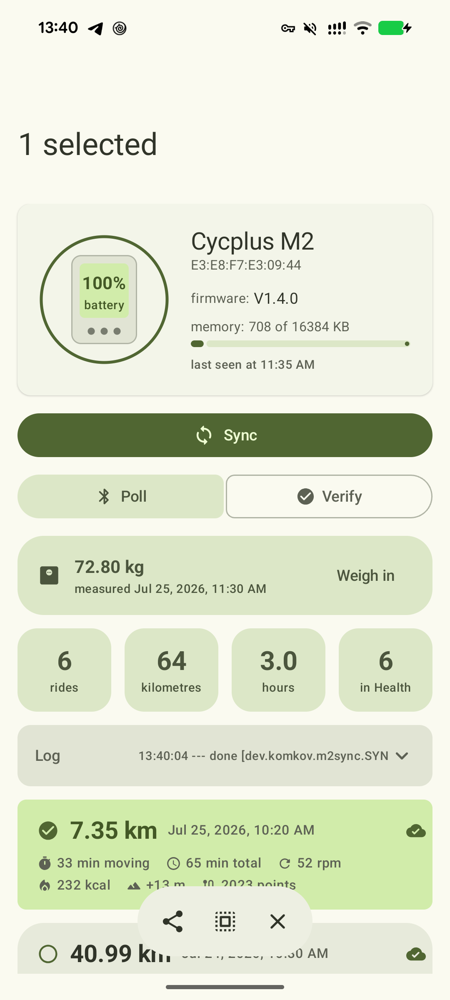
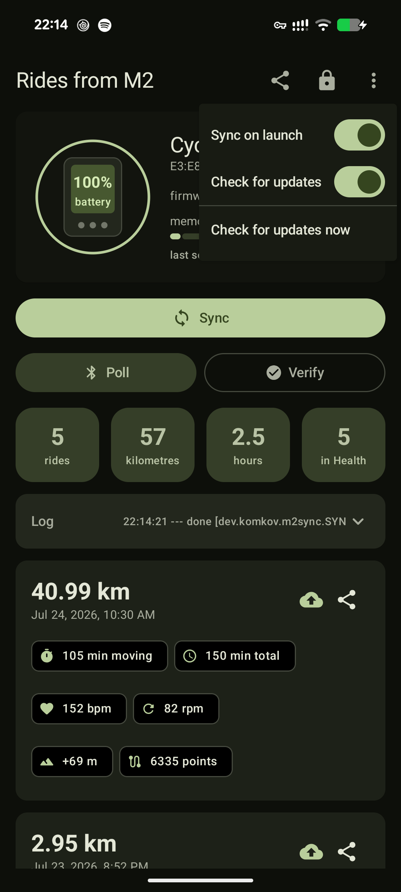

# M2 Sync — велокомпьютер Cycplus M2 / XOSS → Health Connect

[English version](README.md)

Забирает заезды с GPS-велокомпьютера **Cycplus M2** (и родственных XOSS) прямо на телефон по
Bluetooth, кладёт их в **Health Connect** и отдаёт исходные `.fit` куда угодно — **без облака
производителя, без аккаунта и без фирменного приложения**.

| Заезды | Выбор нескольких | Настройки |
| --- | --- | --- |
|  |  |  |

## Зачем

Штатный путь гонит каждый заезд через облако производителя, а со стороны Google всё ещё и
переезжает: **API Google Fit отключаются в конце 2026 года**, само приложение Fit заменено на
Google Health, и единой точкой хранения на устройстве стал **Health Connect**. Приложение пишет
сразу туда — заезды видят и Google Health, и Strava, и Garmin Connect, а файлы остаются у тебя.

## Что умеет

- **Синхронизация по BLE** — находит велокомпьютер, качает только новые заезды (228 КБ за ~13 с)
- **Импорт в Health Connect** — велосипедная сессия с треком, пульсом, каденсом, скоростью,
  дистанцией и набором высоты; остановки размечаются сегментами, поэтому время в движении честное
- **Без дублей** — дедупликация по `clientRecordId`, повторный синк безопасен
- **Экспорт `.fit`** — можно отправить один заезд или сразу пачку, с читаемыми именами вида
  `2026-07-24_10-30_40.99km_cycplus-m2.fit`
- **Калории, которых у M2 нет** — считаются сами: по пульсу формулой Keytel (2005), по скорости
  через MET как запасной путь, и пишутся в `TotalCaloriesBurnedRecord`
- **Умные весы** — вес снимается прямо из рекламы Bluetooth-весов и кладётся в Health Connect;
  свежий вес сразу идёт в расчёт калорий
- **Проверка** — читает заезды обратно из Health Connect и показывает, чего не хватает и какие
  чужие приложения писали записи за те же дни
- **Синк при запуске** — открыл приложение, оно само нашло велокомп и забрало новые заезды за ~3 с
- **Проверка обновлений** — спрашивает релизы на GitHub и ставит новую версию не выходя из
  приложения: APK качается внутрь, сверяется с опубликованной суммой sha256 и отдаётся системному
  установщику, так что видно только штатный диалог Android «обновить приложение?»
- **Заезд крупным планом** — по нажатию открывается маршрут на подложке OpenStreetMap и графики
  высоты, скорости, пульса и каденса, которые можно протягивать пальцем
- **Полёт в 3D** — камера идёт по треку с высоты птичьего полёта, карта натянута на землю в
  перспективе; перетаскивание вращает, щипок приближает, двойной тап возвращает вид. Ни ключа,
  ни учётки не нужно, а подложку можно выключить и остаться полностью офлайн
- **Полное управление через ADB** — любое действие запускается без экрана
- **Material 3 Expressive** с динамическими цветами, русский и английский языки
- **Карточка устройства** — модель, прошивка, заряд, свободная память прямо с компьютера

## Установка

Возьми APK в [релизах](https://github.com/andrewkomkov/cycplus-m2-sync/releases) или собери сам:

```bash
git clone https://github.com/andrewkomkov/cycplus-m2-sync.git
cd cycplus-m2-sync/android
./gradlew :app:assembleDebug
adb install -r app/build/outputs/apk/debug/app-debug.apk
```

Нужен Android 13 и новее с Health Connect (в Android 14+ он встроен).

Отладочная сборка ставится как `dev.komkov.m2sync.debug` и живёт рядом с релизной, а не поверх
неё. Собирая из исходников, подставляй это имя пакета в команды ADB ниже.

Разрешения выдаются кнопкой в приложении (замок) или целиком из терминала:

```bash
for p in BLUETOOTH_SCAN BLUETOOTH_CONNECT POST_NOTIFICATIONS; do
  adb shell pm grant dev.komkov.m2sync android.permission.$p
done
for p in WRITE_EXERCISE WRITE_EXERCISE_ROUTE WRITE_HEART_RATE WRITE_DISTANCE \
         WRITE_SPEED WRITE_ELEVATION_GAINED WRITE_TOTAL_CALORIES_BURNED WRITE_WEIGHT \
         READ_EXERCISE READ_HEART_RATE READ_DISTANCE READ_SPEED READ_WEIGHT; do
  adb shell pm grant dev.komkov.m2sync android.permission.health.$p
done
```

`$S.PERMS` печатает точный список, который ждёт текущая сборка, — он не устареет вместе с этим
куском.

## Управление из терминала

```bash
S="adb shell am start-foreground-service -n dev.komkov.m2sync/.SyncService -a dev.komkov.m2sync"

$S.SCAN                    # найти велокомпьютер
$S.SYNC                    # скачать новые заезды и импортировать
$S.SYNC -e name M2_XXXX    # к конкретному устройству
$S.INFO                    # прошивка, заряд, свободная память
$S.IMPORT                  # только импорт уже скачанного
$S.IMPORT -e force 1       # переимпортировать всё заново
$S.STATUS                  # что лежит локально
$S.VERIFY                  # прочитать обратно из Health Connect и сверить
$S.WEIGH                   # дождаться замера с весов и сохранить вес
$S.PERMS                   # какие строки разрешений ждёт Health Connect

adb logcat -s M2SYNC       # весь ход работы
```

Файлы лежат в `/storage/emulated/0/Android/data/dev.komkov.m2sync/files/fit`:

```bash
adb pull /storage/emulated/0/Android/data/dev.komkov.m2sync/files/fit ./rides
```

## Поддерживаемые устройства

Проверено на **Cycplus M2**, прошивка V1.4.0.

Тот же протокол (Nordic UART + YMODEM) используется во всей линейке XOSS, так что с поправкой
префикса имени должны работать XOSS G / G+ Gen1 / G2+ / Gen3 / NAV / Sprint, Cycplus M1 / M3,
CooSpo BC102 / BC107 / BC200. У новых моделей (NAV, G2+) список заездов лежит в `workouts.json`,
а не в `filelist.txt` — это пока не поддержано. Отчёты приветствуются.

## Что попадает в Health Connect

| Запись Health Connect | Источник в `.fit` |
| --- | --- |
| `ExerciseSessionRecord` (велосипед) + `ExerciseRoute` | сессия + трек 1 Гц |
| `ExerciseSegment` (езда / пауза) | разрывы в записи |
| `HeartRateRecord` | `heart_rate` по точкам |
| `CyclingPedalingCadenceRecord` | `cadence` |
| `SpeedRecord`, `DistanceRecord` | `enhanced_speed`, итог сессии |
| `ElevationGainedRecord` | `total_ascent` |
| `TotalCaloriesBurnedRecord` | расчёт — см. ниже |
| `WeightRecord` | Bluetooth-весы, а не велокомпьютер |

### Калории

M2 их не пишет вовсе: `total_calories` пуст и в `session`, и в `lap`. Поэтому приложение считает
само — по пульсу формулой Keytel et al. (2005), которая построена ровно на том, что уже есть в
`.fit` посекундно, и по скорости через MET (Compendium of Physical Activities) там, где пульса
нет. Обе модели дают полный расход за время движения — это и есть семантика
`TotalCaloriesBurnedRecord`. Если в заезде `total_calories` всё же есть, берётся он.

Для расчёта нужны вес, год рождения и пол. Вес берётся из свежей `WeightRecord` в Health Connect —
кнопка ⚖ снимает его с Bluetooth-весов. Год рождения и пол читаются из медкарты Health Connect
(FHIR `Patient`), если они там есть, иначе спрашиваются один раз в **⋮ → Профиль для калорий**.
Поменял любое из этого — заезды пересчитываются сразу.

### Умные весы

Вес читается из стандартной рекламы Weight Scale (`0x181D`): без спаривания и без подключения,
приложение просто слушает эфир. Проверено на **Mi Smart Scale 2**. Состава тела в эфире нет —
импеданс живёт в 13-байтном пакете `0x181B`, который весы не шлют, а процент жира Mi Fit считает
на телефоне сам.

## Протокол

Устройство говорит по YMODEM поверх Nordic UART Service. Подробный разбор с командами и
отличиями между моделями: [docs/PROTOCOL.md](docs/PROTOCOL.md).

## Инструменты для компьютера (по желанию)

Python-CLI, чтобы забирать заезды без телефона и щупать незнакомую модель:

```bash
pip install -r tools/requirements.txt
python tools/m2_cli.py scan          # BLE-устройства рядом
python tools/m2_cli.py info          # модель, прошивка, заряд, память
python tools/m2_cli.py sync          # скачать новые .fit в ./fit
python tools/m2_cli.py services      # полная карта GATT — для новых устройств
python tools/fit_summary.py          # что внутри скачанных файлов
```

## Приватность

Заезды не покидают телефон: ни аналитики, ни аккаунта, ни выгрузки. Единственный сетевой запрос,
который приложение может сделать — проверка версии на `api.github.com/repos/…/releases/latest`;
она не отправляет ничего, кроме User-Agent, и отключается в меню ⋮. Вес, год рождения и пол нужны
только для расчёта калорий и никуда не уходят: профиль лежит в настройках приложения, вес — в
Health Connect.

## Благодарности

- [ekspla/xoss_sync](https://github.com/ekspla/xoss_sync) — рабочая реализация протокола на Python,
  с которой всё началось
- [Kaiserdragon2/CycSync](https://github.com/Kaiserdragon2/CycSync) — ранняя заготовка Android-аппа
  под Cycplus M2
- [Garmin FIT SDK](https://github.com/garmin/fit-java-sdk) — разбор FIT

Проект не связан с Cycplus, XOSS, Garmin или Google.

## Лицензия

MIT — см. [LICENSE](LICENSE).
